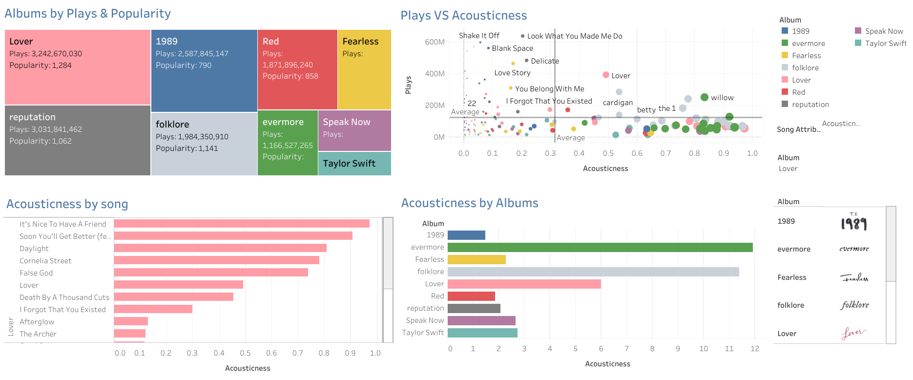

# Taylor Swift Music Insights Dashboard

Welcome to the Taylor Swift Music Insights Dashboard project! This repository contains the code and resources for a comprehensive data analysis and visualization project focused on Taylor Swift's 2022 songs data, sourced from Kaggle and Spotify.

### Interactive Dashboard
- The interactive dashboard is published on Tableau Public and can be accessed [here](https://public.tableau.com/app/profile/prerna.pattanaik/viz/TaylorSwiftSongsDashboard/TaylorSwiftSongsDashboard?publish=yes).

  

## Features
- **Data Cleaning and Preparation**: Using Tableau Prep to clean and prepare the data.
- **Interactive Dashboard**: Developed in Tableau, showcasing:
  - Most played albums
  - Exploration of different song genres
  - Various song and album attributes

